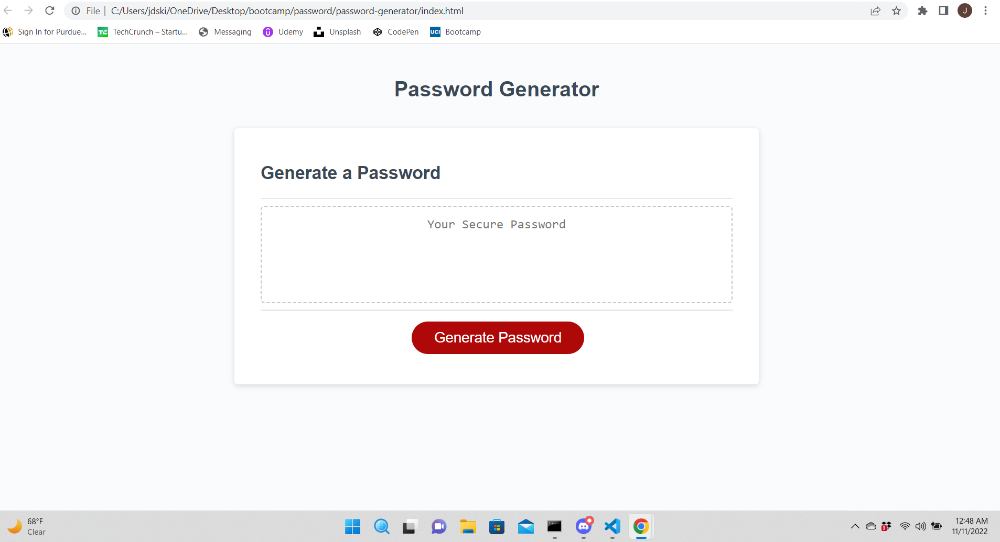

# <Random-Password-Generator>

## Description

My motivation for this project was to create a functioning tool to generate a random password based on the users preferences. I built it to help create secure passwords for people who want to protect their information. It helps to solve the problems with data security and weak passwords. I learned a lot about randomizing and compiling values with javascript to create a functioning tool on a website.

## Installation

N/A will run on your web browser.

## Usage

To use go to URL(https://jeremyskinner812.github.io/password-generator/) and click generate password button. Answer the prompts, being sure to say ok to at least one of the four options and giving a valid number between 8 and 128 for the password length. The random password will be generated in the box and can be copy pasted to where it is needed.

  

## Credits

Starter code from UCI Coding Bootcamp.
Tutorials followed from W3 schools and Stack Overflow

## License

N/A

🏆 The previous sections are the bare minimum, and your project will ultimately determine the content of this document. You might also want to consider adding the following sections.

 